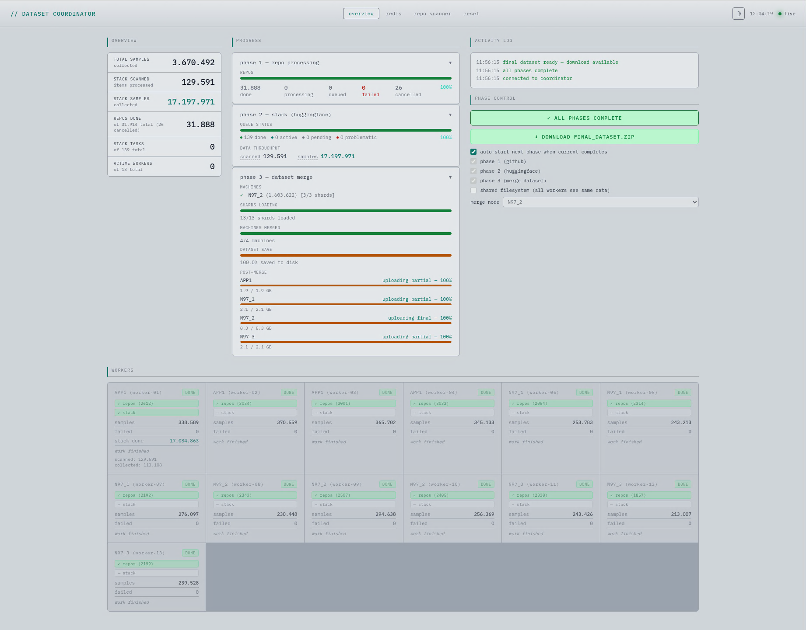

# Copilot - LLM Scraping Pipeline

A distributed pipeline that collects source code of the programming language you define from GitHub and HuggingFace
The Stack v1 to build an LLM fine-tuning dataset in **Fill-in-the-Middle (FIM)** format. With this, you can build your
Copilot.



## Overview

The pipeline runs across a fleet of worker machines coordinated by a single HTTP server. It
collects files of your defined programming language, filters for quality, deduplicates, formats for FIM training, and
assembles everything into a single Arrow/Parquet dataset ready for SFT tuning.

### Warning

Ensure that your language is inside HuggingFace The Stack v1, otherwise run HF search is useless.

## Architecture

```
┌────────────────────────────────────┐    ┌────────────────────────┐
│           Coordinator              │    │      Redis Cluster     │
│  (TypeScript / Koa / Node.js)      │◄──►│   (3 dedicated nodes)  │
│                                    │    └────────────────────────┘
│  ┌──────────┐  ┌────────────────┐  │
│  │ HTTP API │  │ Web Dashboards │  │
│  │  :3981   │  │ (SSE + HTML)   │  │
│  └──────────┘  └────────────────┘  │
└─────────────────┬──────────────────┘
                  │ poll / report
     ┌────────────┼────────────┐
     │            │            │
┌────▼─────┐ ┌────▼─────┐ ┌────▼─────┐
│ Worker 1 │ │ Worker 2 │ │ Worker N │
│ (Python) │ │ (Python) │ │ (Python) │
└──────────┘ └──────────┘ └──────────┘
```

All coordination state lives in a **Redis Cluster**. The coordinator is the single source
of truth; workers are stateless and crash-safe.

**Coordinator crash resilience** — every worker HTTP call (`coord_get` / `coord_post`) retries
indefinitely on `ConnectionError`, `Timeout`, and any 5xx response, waiting 60 s between
attempts. Large-file uploads and partial downloads use the same policy (30 s backoff).
If the coordinator crashes and restarts, workers simply pause and resume automatically with
no manual intervention required. 4xx client errors (e.g. bad parameters) are the only class
that does not retry indefinitely.

## Pipeline Phases

### Phase 1 — GitHub repo processing

Workers claim repositories from the coordinator queue (seeded from `input_data/repos_found.txt`).
Each worker shallow-clones the repo to a tmpfs ramdisk, extracts `.ts`/`.mts`/`.cts` files,
applies quality filters, formats them as FIM samples, and reports back. Use the built-in
**Repo Scanner** utility (`GET /queries-gen`) to populate the repo list via GitHub search before
starting this phase.

### Phase 2 — HuggingFace Stack scraping

Workers claim batches from `bigcode/the-stack` on HuggingFace. The coordinator splits the
dataset's Parquet shards into tasks at seed time; each worker processes a disjoint slice
(`item_id % total_batches === batch_index`). Supports multiple languages via `THE_STACK_LANGUAGES`.

### Phase 3 — Dataset merge

One worker per machine (or one globally on a shared filesystem) concatenates all per-node Arrow
shards into `data/data3/final_dataset/`. On multi-machine setups without a shared filesystem, the
**Final Merger** (elected via atomic Redis `SETNX`) downloads partial tar.zst archives from the coordinator,
integrates them sequentially, applies a final shuffle, and uploads the complete dataset. Once
every machine reports done the coordinator sets `fleet:state=done`; it does not exit on its own.

## Output Format

Each record in the final dataset has three fields:

| Field    | Type   | Description                                                                                           |
|----------|--------|-------------------------------------------------------------------------------------------------------|
| `text`   | string | FIM-formatted: `<\|fim_prefix\|>{prefix}<\|fim_suffix\|>{suffix}<\|fim_middle\|>{middle}<\|eot_id\|>` |
| `lang`   | string | Language tag, e.g. `typescript`                                                                       |
| `source` | string | Origin: `the-stack:typescript` or `github:{owner/repo}`                                               |

## Subprojects

| Subproject                                                        | Stack                      | Description                                                                      |
|-------------------------------------------------------------------|----------------------------|----------------------------------------------------------------------------------|
| [`llm-scraping-coordinator/`](llm-scraping-coordinator/README.md) | TypeScript / Node.js / Koa | Orchestrates the fleet; exposes the HTTP API workers poll; serves web dashboards |
| [`llm-scraping-worker/`](llm-scraping-worker/README.md)           | Python 3.14                | Runs on each node; clones repos, streams HF datasets, merges Arrow shards        |

See each subproject's README for setup, configuration, and API reference.

## Quick Start

1. **Start the coordinator** — see [`llm-scraping-coordinator/README.md`](llm-scraping-coordinator/README.md)
2. **Scan repos** — open `http://<coordinator>:3981/queries-gen`, run the Repo Scanner, wait for
   `input_data/repos_found.txt` to be written
3. **Start workers** — see [`llm-scraping-worker/README.md`](llm-scraping-worker/README.md)
4. **Monitor** — open `http://<coordinator>:3981` for the real-time fleet dashboard
5. **Collect output** — when all phases complete, the Final Merger worker uploads the complete dataset
   to the coordinator (`data3/final_dataset.zip`); the coordinator sets fleet state to `done` and
   the file is available for download via `GET /merge/download_final`

